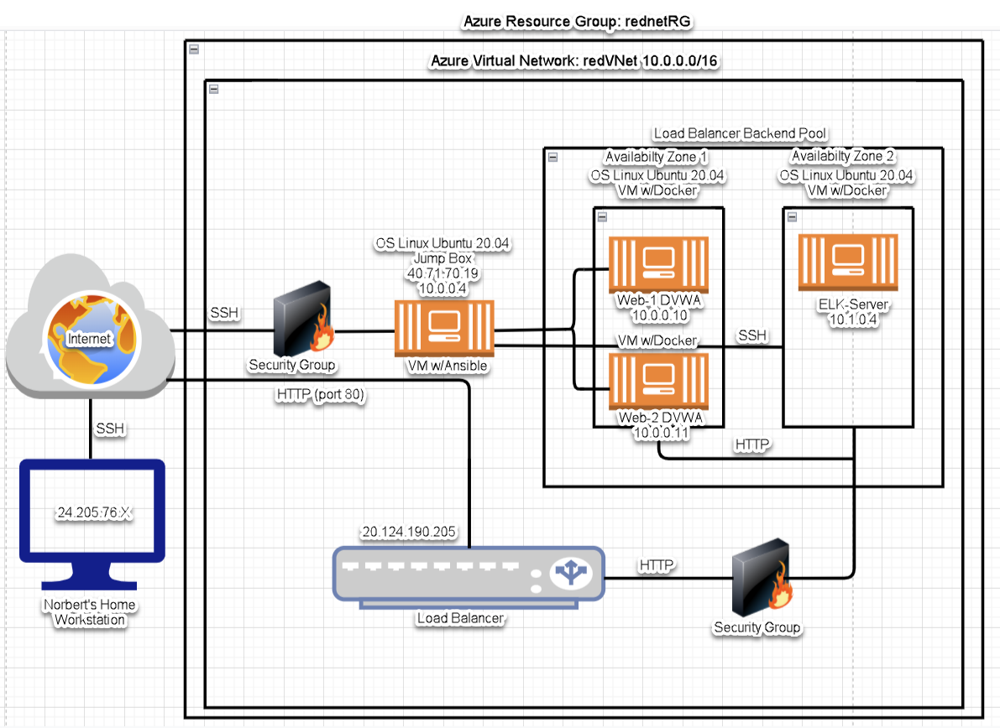
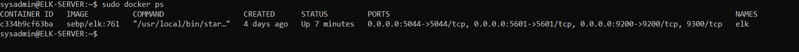

# CyberExRepo
My Cyber Repository
## Automated ELK Stack Deployment

The files in this repository were used to configure the network depicted below.

These files have been tested and used to generate a live ELK deployment on Azure. They can be used to either recreate the entire deployment pictured above. Alternatively, select portions of the ansible file may be used to install only certain pieces of it, such as Filebeat.

  - _TODO: Enter the playbook file._ install-elk.yml

This document contains the following details:
- Description of the Topology
- Access Policies
- ELK Configuration
  - Beats in Use
  - Machines Being Monitored
- How to Use the Ansible Build

### Description of the Topology

The main purpose of this network is to expose a load-balanced and monitored instance of DVWA, the D*mn Vulnerable Web Application.

Load balancing ensures that the application will be highly available, in addition to restricting access to the network.
The aspect of security that load balancers protect is Availability. The advantage of the Jumpbox is to provide Secure access to the network (Access control)

Integrating an ELK server allows users to easily monitor the vulnerable VMs for changes to the files and system components.
Filebeat watches for changes to file system data including 
Metricbeat watches for system metrics that indicate system health

The configuration details of each machine may be found below.
_Note: Use the [Markdown Table Generator](http://www.tablesgenerator.com/markdown_tables) to add/remove values from the table_.

| Name     | Function | IP Address | Operating System |
|----------|----------|------------|------------------|
| Jump Box | Gateway  | 10.0.0.4   | Linux            |
| Web-1    | Webserver| 10.0.0.11  | Linux            |
| Web-2    | Webserver| 10.0.0.10  | Linux            |
|ELK-Server|Monitoring| 10.1.0.4   | Linux            |

### Access Policies

The machines on the internal network are not exposed to the public Internet. 

Only the Jumpbox machine can accept connections from the Internet. Access to this machine is only allowed from the following IP addresses: 24.205.76.108

Machines within the network can only be accessed by other machines within their defined internal network.
The jumpbox machine is the only one with access to the ELK VM and has IP 10.0.0.4

A summary of the access policies in place can be found in the table below.

| Name     | Publicly Accessible | Allowed IP Addresses |
|----------|---------------------|----------------------|
| Jump Box |  Yes                | 24.205.76.108        |
|  Web-1   |  No                 | 10.0.0.4             |
|  Web-2   |  No                 | 10.0.0.4             |
|ELK-Server|  No                 | 10.0.0.4             |

### Elk Configuration

Ansible was used to automate configuration of the ELK machine. No configuration was performed manually, which is advantageous because it avoids individually having to configure each of the three servers without containers, connecting them together and then connecting them to the network plus errors and delay of using the manual process.
The main advantage of automating configuration with Ansible aside from the advantages of containerization mentioned above is that it avoids errors, is faster, and is repeatable.
 
The playbook implements the following tasks:
- _TODO: In 3-5 bullets, explain the steps of the ELK installation play. E.g., install Docker; download image; etc._
- ...
-Install docker and ensure it is in a running state
-Install Python 3 and ensure it is in a running state
-Install the docker python module and ensure it is in a running state
-Increase the memory usage to the desired value 262144 MB
-download and lauch the docker elk container with the required published ports bidirectional 5601, 9200, 5044
-enable the docker service on boot for persistence

- ...

The following screenshot displays the result of running `docker ps` after successfully configuring the ELK instance.
 

### Target Machines & Beats
This ELK server is configured to monitor the following machines:
- _TODO: List the IP addresses of the machines you are monitoring_ 

10.0.0.10 : **Web-2**
10.0.0.11 : **Web-1**

We have installed the following Beats on these machines:
- _TODO: Specify which Beats you successfully installed_ 
filebeat & metricbeat installed on **Web-1**
filebeat & metricbeat installed on **Web-2**

These Beats allow us to collect the following information from each machine:
- _TODO: In 1-2 sentences, explain what kind of data each beat collects, and provide 1 example of what you expect to see. E.g., `Winlogbeat` collects Windows logs, which we use to track user logon events, etc._
- Beats allow us to collect log information about a system but unlike other built-in log collectors such as auditd and syslog, beats will only collect eventful logs that are of interest thereby also simplifying the parsing process. 
- The two types of beats we configured are filebeat and metricbeat.  Filebeat collects data about the file system such as packetbeat which monitors network traffic packet data as it traverses the network.
- Metricbeat on the other hand collects machine metrics that provide useful information as to the machines' health. Common metrics include CPU usage and machine uptime.
- There are also other types of beats such as auditbeat, heartbeat, functionbeat, winlogonbeat etcetera.
### Using the Playbook
In order to use the playbook, you will need to have an Ansible control node already configured. Assuming you have such a control node provisioned: 

SSH into the control node and follow the steps below:
- Copy the SSH key file from the Ansible container on the jumpbox to the new ELK server VM.
- Update the Ansible hosts file to include the new ELK-Server IP  addresses.
- Run the playbooks, and navigate to the docker container to check that the installation worked as expected.
  - ansible-playbook /etc/ansible/install-elk.yml
  - ansible-playbook /etc/ansible/filebeat-playbook.yml
  - ansible-playbook /etc/ansible/metricbeat-playbook.yml

_TODO: Answer the following questions to fill in the blanks:_
- _Which file is the playbook? In my case it was install-elk.yml Where do you copy it?_ root@94b332d67d37:/etc/ansible
- _Which file do you update to make Ansible run the playbook on a specific machine? The hosts file /etc/ansible/hosts How do I specify which machine to install the ELK server on versus which to install Filebeat on?_ Machines to install ELK server on are specified in the ELK group within the ansible hosts file while target machines for the filebeat install are specified within the filebeat-config.yml file
- _Which URL do you navigate to in order to check that the ELK server is running? http://[your.VM.IP]:5601/app/kibana

_As a **Bonus**, provide the specific commands the user will need to run to download the playbook, update the files, etc._ # ansible-playbook filebeat-playbook.yml
